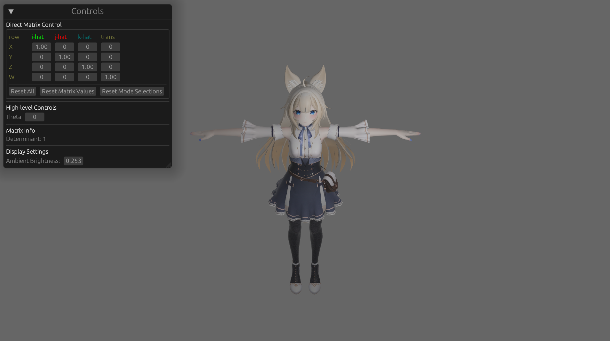

# Arbitrary Matrix Transform Demo

A GUI for simulating various matrix transforms in 3D.
Uses a 4x4 matrix to parametrically rotate a GLTF of me.
Initially inspired by [affine transformation rules](https://web.cs.wpi.edu/~emmanuel/courses/cs543/slides/lecture04_p1.pdf).

